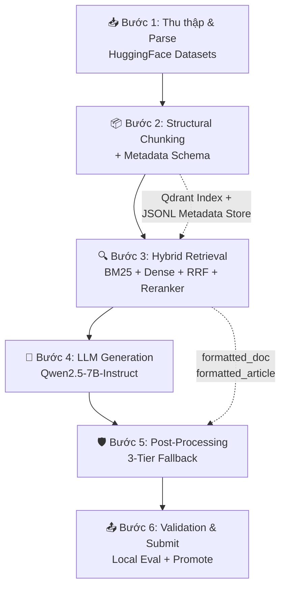
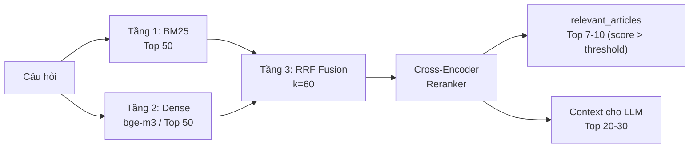
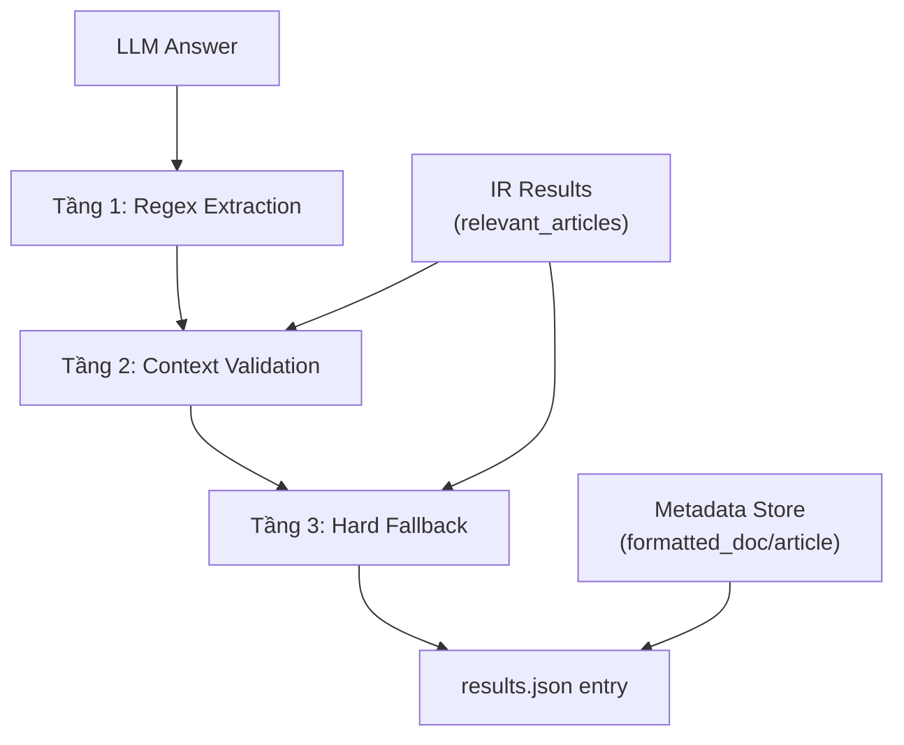

# 🏗️ AIGuru Legal RAG — Implementation Plan Chi Tiết

> **Mục tiêu**: Xây dựng hệ thống RAG pháp lý cho 2000 câu hỏi SME, tối ưu F2 score, chạy trên Colab (< 14B model, trước 01/03/2026).
> **Deadline**: 30/06/2026 23:59 UTC+7 | **Private Phase**: tối đa 5 lượt nộp

```

---

## Cấu Trúc Thư Mục Dự Án

```
AIGuru/
├── .venv/                      # Python virtual environment (Windows)
├── .gitignore
├── pyproject.toml              # Package metadata (editable install)
├── requirements.txt            # Phase 1 dependencies
├── implementation_plan.md      # This file
├── plan.md                     # Original plan
│
├── data/                       # Competition data
│   ├── Bối cảnh bài toán.docx
│   ├── Dashboard kết quả.docx
│   ├── Dữ liệu cuộc thi.docx
│   ├── Phương pháp đánh giá.docx
│   └── R2AIStage1DATA.json     # 2000 test questions
│
├── src/                        # Source package
│   └── aiguru/
│       ├── __init__.py
│       ├── paths.py            # Shared path definitions
│       └── phase1/
│           ├── __init__.py
│           ├── config.py       # Dataset candidates, SME keywords
│           ├── metadata_schema.py  # ChunkMetadata, KnowledgeChunk
│           ├── collect.py      # HuggingFace data collector
│           └── chunk.py        # Structural chunker
│
├── scripts/                    # Entry points
│   ├── run_phase1_collect.py
│   └── run_phase1_chunk.py
│
├── raw_data/                   # Collector output
│   ├── legal_docs_raw.jsonl
│   ├── precedents_raw.jsonl
│   └── collection_report.json
│
├── knowledge_store/            # Chunker output
│   ├── chunks.jsonl
│   ├── chunk_stats.json
│   └── metadata_errors.jsonl
│
├── reports/                    # Analytics
├── output/                     # Pipeline final output
│   ├── results_partial.jsonl  # JSONL crash-proof streaming
│   ├── results.json           # Final submission format
│   └── submission.zip
└── __pycache__/

```

**Cách chạy**:
```bash
# Activate venv
.\.venv\Scripts\activate

# Run Phase 1
python scripts\run_phase1_collect.py
python scripts\run_phase1_chunk.py
```

---

## Tổng Quan Kiến Trúc



---

## PHASE 1: Dữ Liệu & Chunking (Bước 1-2)

### 1.1 Thu Thập Dữ Liệu

| Nguồn     | Dataset HuggingFace   | Nội dung chính                           |
| --------- | --------------------- | ---------------------------------------- |
| Pháp điển | `phapdien-moj-gov-vn` | Đề mục → Chủ đề → Điều luật              |
| Án lệ     | `anle-toaan-gov-vn`   | Khái quát, Tình huống, Giải pháp pháp lý |

**Lọc miền SME** — chỉ index các văn bản thuộc:

- Luật Doanh nghiệp, Luật Hỗ trợ DNNVV
- Luật Lao động, Luật Thuế (TNDN, VAT, Môn bài)
- Luật Thương mại, Luật Sở hữu trí tuệ
- Luật Kế toán, các Nghị định/Thông tư hướng dẫn

### 1.2 Knowledge Chunk Schema

Mỗi chunk sau khi Structural Chunking sẽ tuân theo schema cố định:

```json
{
  "chunk_id": "04/2017/QH14_Dieu_4_Khoan_1",
  "text": "Nội dung điều luật đầy đủ...",
  "metadata": {
    "doc_id": "04/2017/QH14",
    "doc_type": "Luật",
    "doc_title": "Luật Hỗ trợ doanh nghiệp nhỏ và vừa",
    "article_number": "Điều 4",
    "formatted_doc": "04/2017/QH14|Luật 04/2017/QH14 Luật Hỗ trợ doanh nghiệp nhỏ và vừa",
    "formatted_article": "04/2017/QH14|Luật 04/2017/QH14 Luật Hỗ trợ doanh nghiệp nhỏ và vừa|Điều 4"
  }
}
```

> [!IMPORTANT]
> `formatted_doc` và `formatted_article` phải tuân thủ **chính xác** công thức BTC:
>
> - `relevant_docs`: `<mã VB>|<Loại VB> <Mã VB> <Trích yếu>`
> - `relevant_articles`: `<mã VB>|<Loại VB> <Mã VB> <Trích yếu>|<Điều X>`

### 1.3 Quy Tắc Chunking

| Loại Văn bản            | Đơn vị Chunk          | Ghi chú                                          |
| ----------------------- | --------------------- | ------------------------------------------------ |
| Luật/Nghị định/Thông tư | Từng **Điều** độc lập | Nếu Điều quá dài (>1500 token) → tách theo Khoản |
| Án lệ                   | Từng **vụ án**        | Gộp: Khái quát + Tình huống + Giải pháp          |
| Bảng biểu trong Điều    | Markdown Table        | Gộp vào chunk của Điều chứa bảng đó              |

### 1.4 Lưu Trữ

```
knowledge_store/
├── chunks.jsonl          # Mỗi dòng = 1 chunk JSON (schema ở trên)
├── bm25/                 # BM25 pre-built corpus
└── storage/aiguru_legal/ # Qdrant persistent index từ embeddings
```

- **Qdrant Vector DB** (persistent) — lưu trực tiếp xuống ổ cứng, chống sập RAM Colab
- **JSONL** cho metadata — load nhanh, dễ debug, dễ checkpoint

---

## PHASE 2: Hybrid Retrieval (Bước 3)

### 2.1 Pipeline Retrieval 3 Tầng



### 2.2 Chi Tiết Từng Tầng

**Tầng 1 — BM25 (Sparse)**

- Thư viện: `rank_bm25`
- Tokenizer: N-gram Regex + Legal Phrases (thay thế AI segmentation để tránh tràn RAM Colab)
- Lấy: **Top 50** kết quả
- Mục đích: Bắt chính xác thuật ngữ pháp lý cố định ("vốn điều lệ", "Điều 4")

**Tầng 2 — Dense Retrieval**

- Model: `BAAI/bge-m3` (568M params, hỗ trợ tiếng Việt tốt, trước 03/2026)
- Alternative: `bkai-foundation-models/vietnamese-bi-encoder`
- Encode offline toàn bộ chunks → Qdrant persistent index
- Query time: encode câu hỏi → cosine similarity → **Top 50**

**Tầng 3 — RRF Fusion + Reranking**

RRF score cho mỗi document `d`:

```
RRF(d) = Σ 1/(k + rank_i(d))    với k = 60
```

Sau RRF → lấy **Top 30** → đưa qua Cross-Encoder Reranker:

- Model: `BAAI/bge-reranker-v2-m3` hoặc `cross-encoder/ms-marco-MiniLM-L-6-v2`
- Output: relevance score [0, 1] cho mỗi cặp (query, chunk)

### 2.3 Dynamic Thresholding (Tối ưu F2)

```
Inputs:  reranked_results = [(chunk, score), ...] sorted desc
Config:  SAFE_THRESHOLD = 0.3
         HIGH_CONF_THRESHOLD = 0.5
         MAX_ARTICLES = 10
         MAX_CONTEXT = 25

Output cho relevant_articles:
  → Lấy tất cả chunks có score >= HIGH_CONF_THRESHOLD, tối đa MAX_ARTICLES
  → Nếu < 3 kết quả: hạ threshold xuống 0.4, retry

Output cho LLM context:
  → Lấy tất cả chunks có score >= SAFE_THRESHOLD, tối đa MAX_CONTEXT

Edge case — Zero Recall:
  → Nếu top-1 score < SAFE_THRESHOLD → kích hoạt Safe Response mode
```

> [!TIP]
> F2 trọng Recall gấp 4 lần Precision → **thà bắt nhầm hơn bỏ sót**. Khi nghi ngờ, thêm chunk vào `relevant_articles` thay vì bỏ qua.

### 2.4 Context Formatting — Chống Xung Đột Số Hiệu Điều

Khi nhiều văn bản cùng có "Điều 4", "Điều 5" (ví dụ: Luật 04/2017/QH14 và Nghị định 80/2021/NĐ-CP), nối chuỗi ngây thơ sẽ khiến LLM không phân biệt được. **Ép cấu trúc phân đoạn tường minh**:

```markdown
=== CƠ SỞ DỮ LIỆU THAM CHIẾU ===

[VĂN BẢN 1]: Luật 04/2017/QH14 - Luật Hỗ trợ doanh nghiệp nhỏ và vừa

- Nội dung Điều 4: {chunk_text}
- Nội dung Điều 5: {chunk_text}

[VĂN BẢN 2]: Nghị định 80/2021/NĐ-CP - Hướng dẫn Luật Hỗ trợ DNNVV

- Nội dung Điều 4: {chunk_text}
- Nội dung Điều 5: {chunk_text}

---
```

**Thuật toán xây context** (trong `step4_retrieve.py`):

```
1. Nhận danh sách chunks đã rerank (top 20-30)
2. Group chunks theo doc_id (metadata.doc_id)
3. Trong mỗi group, sort theo article_number tăng dần
4. Render theo template [VĂN BẢN N] với header = doc_type + doc_id + doc_title
5. Mỗi chunk render dạng: "- Nội dung {article_number}: {text}"
```

> [!IMPORTANT]
> Cấu trúc phân cấp này giúp LLM phân biệt ranh giới giữa các văn bản, tránh "râu ông nọ cắm cằm bà kia" khi trích dẫn Điều luật.

---

## PHASE 3: LLM Generation (Bước 4)

### 3.1 Model Selection

| Ưu tiên | Model                                     | Params | Ghi chú                                |
| ------- | ----------------------------------------- | ------ | -------------------------------------- |
| 1       | `Qwen/Qwen2.5-7B-Instruct`                | 7B     | Tốt nhất cho tiếng Việt, AWQ quantized |
| 2       | `deepseek-ai/DeepSeek-R1-Distill-Qwen-7B` | 7B     | Reasoning mạnh                         |
| 3       | `Qwen/Qwen2.5-14B-Instruct-AWQ`           | 14B    | Nếu VRAM đủ (A100)                     |

Inference: **vLLM** (batched, ~200 tok/s trên T4) hoặc **HuggingFace Transformers** fallback.

### 3.2 Prompt Template (3 Vùng)

```
=== SYSTEM PROMPT (Vùng Ràng Buộc) ===

Bạn là trợ lý pháp lý AI chuyên về pháp luật Việt Nam cho doanh nghiệp SME.

QUY TẮC BẮT BUỘC:
1. CHỈ sử dụng thông tin trong [CONTEXT] bên dưới để trả lời. TUYỆT ĐỐI KHÔNG
   bịa đặt điều luật, số hiệu văn bản, hoặc thông tin không có trong context.
2. Khi trích dẫn căn cứ pháp lý, BẮT BUỘC viết rõ "Điều X" (ví dụ: Điều 4,
   Điều 20) trong phần lập luận.
3. Nếu không tìm thấy căn cứ pháp lý trong context, trả lời: "Hiện tại hệ thống
   dữ liệu chưa ghi nhận quy định pháp lý cụ thể cho tình huống này."
4. Kết thúc câu trả lời bằng đoạn tư vấn sơ bộ và dòng cảnh báo chuẩn.

=== USER PROMPT (Vùng Context + Câu hỏi) ===

[CONTEXT]
{context_from_retrieval_pipeline}
[/CONTEXT]

Câu hỏi: {question}

=== FORMAT (Vùng Ép Định Dạng) ===

Trả lời theo cấu trúc:
1. **Căn cứ pháp lý**: Liệt kê rõ Điều X của văn bản nào
2. **Phân tích**: Giải thích nội dung điều luật áp dụng vào tình huống
3. **Tư vấn sơ bộ**: Hướng dẫn thực tế cho doanh nghiệp
4. **Cảnh báo**: "Cảnh báo giới hạn: Đây là tư vấn sơ bộ từ AI, doanh nghiệp
   cần đối chiếu văn bản gốc hoặc tham khảo chuyên gia pháp lý trước khi áp dụng."
```

### 3.3 Generation Config

```
temperature: 0.1        # Gần deterministic, tránh hallucination
top_p: 0.9
max_new_tokens: 1024     # Đủ cho câu trả lời chi tiết
repetition_penalty: 1.1
```

---

## PHASE 4: Post-Processing 3 Tầng (Bước 5)

### 4.1 Pipeline Hậu Xử Lý



**Tầng 1 — Regex Extraction**

```
Pattern: r'(?:Điều|Điểu|điều)\s+(\d+)'
Input:   answer text
Output:  set of article numbers mentioned {4, 5, 20}
```

**Tầng 2 — Context Validation**

- Đối chiếu số Điều từ Tầng 1 với `relevant_articles` từ IR
- Nếu khớp → chuẩn hóa về dạng "Điều X" chính tắc
- Nếu LLM nhắc Điều không có trong IR results → flag là potential hallucination, giữ lại nhưng không thêm vào `relevant_articles`

**Tầng 3 — Hard Fallback**

- Điều kiện: LLM không sinh bất kỳ "Điều X" nào NHƯNG IR trả score cao (top-1 > 0.7)
- Hành động: Append vào cuối answer:
  `"Cơ sở pháp lý tham chiếu: Điều X, Điều Y của [Tên văn bản]"`
- Mục đích: Cứu điểm "Căn cứ pháp luật" từ Auto-LLM Judge

### 4.2 Lưu Trữ Chống Sập — JSONL Streaming

Nếu lưu results dạng JSON Array truyền thống, Colab crash ở câu 1900 → **mất sạch**. Giải pháp:

```
Pipeline ghi kết quả:
  step5_generate.py + step6_postprocess.py
    → Mỗi câu xử lý xong → append 1 dòng vào results_partial.jsonl
    → Mỗi dòng là 1 JSON object hoàn chỉnh, độc lập

Resume sau crash:
  → Đọc dòng cuối results_partial.jsonl → lấy last_id
  → Resume từ id = last_id + 1

Đóng gói cuối cùng (validate.py):
  → Đọc results_partial.jsonl
  → Parse từng dòng → gom thành list
  → Export ra results.json chuẩn BTC
```

Cấu trúc file streaming:

```
output/
├── results_partial.jsonl   # Ghi liên tục, mỗi dòng 1 entry
├── results.json            # File final cho submission
└── submission.zip          # Auto-generated bởi validate.py
```

> [!CAUTION]
> **Luôn flush sau mỗi dòng ghi**: dùng `open(..., 'a')` + `file.flush()` để đảm bảo dữ liệu được ghi xuống disk ngay lập tức, không nằm trong buffer khi Colab crash.

### 4.3 Đóng Gói results.json

```
Cho mỗi question_id:
  1. Lấy answer từ LLM (đã qua Post-Processing)
  2. Lấy relevant_articles từ IR results → map qua metadata.formatted_article
  3. Deduplicate relevant_docs từ relevant_articles (lấy unique doc_id)
     → map qua metadata.formatted_doc
  4. Ghi 1 dòng JSONL vào results_partial.jsonl
```

> [!WARNING]
> BTC ghi rõ: `<tên văn bản>` = `Loại VB + Mã VB + Trích yếu`. Ví dụ:
>
> - ✅ `"04/2017/QH14|Luật 04/2017/QH14 Luật Hỗ trợ doanh nghiệp nhỏ và vừa"`
> - ❌ `"04/2017/QH14|Luật Hỗ trợ doanh nghiệp nhỏ và vừa"` (thiếu mã VB trong tên)
>
> Cần xác minh lại format chính xác từ ví dụ mẫu của BTC trước khi nộp.

---

## PHASE 5: Validation & Submission (Bước 6)

### 5.1 Validation Script (Chạy trước mỗi lần nộp)

Checklist tự động (10 bước):

1. **JSON valid** — parse không lỗi → nếu fail: Abort
2. **Đủ 2000 entries** (id 1→2000) → nếu thiếu: Abort
3. **Mỗi entry có đủ 5 trường** (id, question, answer, relevant_docs, relevant_articles) → nếu thiếu: Abort
4. **id là integer**, question khớp original → nếu sai: Warning
5. **answer không rỗng** → nếu rỗng: Fill Safe Response tự động
6. **relevant_docs format đúng**: mỗi phần tử có dạng `X|Y` (đúng 1 pipe) → nếu sai: Auto-fix hoặc abort
7. **relevant_articles format đúng**: mỗi phần tử có dạng `X|Y|Điều Z` (đúng 2 pipes) → nếu sai: Auto-fix hoặc abort
8. **Không có ký tự lạ** / unicode bất thường → Strip tự động
9. **Pipe separator đúng vị trí** — regex check từng entry → nếu sai: Abort
10. **ZIP chứa results.json ở root** (không thư mục con) → Re-zip nếu cần

Ngoài ra, `validate.py` cũng đảm nhận việc:

- Đọc `results_partial.jsonl` → chuyển đổi thành `results.json`
- Tự động nén `results.json` → `submission.zip` (flat, không thư mục con)

### 5.2 Local Evaluation Framework

**Mini Dev-Set** (20-30 câu):

- Chọn ngẫu nhiên từ 2000 câu hỏi
- Tự gán nhãn thủ công: ground truth `relevant_articles` + reference answer
- Tính F2 giả lập + so sánh answer quality

**Workflow đánh giá**:

```
1. Chạy pipeline → results_v{N}.json
2. Chạy local_eval.py → F2 score, Precision, Recall
3. So sánh với results_v{N-1}.json
4. Nếu F2 tăng ổn định → nộp lên Dashboard
5. Nếu F2 giảm → debug, không nộp
```

### 5.3 Chiến Lược Promote

```
Tuần 1-2: Tập trung tối ưu IR (F2 score)
  → Nộp 5-8 lần/ngày, thử các config RRF/threshold khác nhau
  → Promote phiên bản F2 cao nhất trước kỳ chấm QA hàng tuần

Tuần 3-4: Tối ưu QA (LLM answer quality)
  → Fine-tune prompt template dựa trên feedback từ leaderboard
  → Promote phiên bản cân bằng tốt nhất giữa IR + QA

Private Phase: CHỈ nộp khi Local Eval ổn định
  → Tối đa 5 lượt, chọn cực kỳ cẩn thận
```

---

## Danh Sách Module Cần Implement

| #   | Module          | File                   | Chức năng                                | Ưu tiên |
| --- | --------------- | ---------------------- | ---------------------------------------- | ------- |
| 1   | Data Collector  | `step1_collect.py`     | Download & parse HuggingFace datasets    | P0      |
| 2   | Chunker         | `step2_chunk.py`       | Structural chunking + metadata injection | P0      |
| 3   | Indexer         | `step3_index.py`       | Build Qdrant index + BM25 corpus         | P0      |
| 4   | Retriever       | `step4_retrieve.py`    | BM25 + Dense + RRF + Reranker            | P0      |
| 5   | Generator       | `step5_generate.py`    | LLM inference với prompt template        | P0      |
| 6   | PostProcessor   | `step6_postprocess.py` | 3-tier fallback + JSON assembly          | P0      |
| 7   | Validator       | `validate.py`          | Format check + auto-fix                  | P1      |
| 8   | Local Evaluator | `local_eval.py`        | F2 calculator trên mini dev-set          | P1      |
| 9   | Submitter       | `submit.py`            | Auto-zip + upload helper                 | P2      |
| 10  | Pipeline Runner | `run_pipeline.py`      | Orchestrate step 1→6 end-to-end          | P0      |

---

## Rủi Ro & Mitigation

| Rủi ro                              | Xác suất   | Mitigation                              |
| ----------------------------------- | ---------- | --------------------------------------- |
| VRAM không đủ cho 7B + Reranker     | Cao        | AWQ quantization, sequential inference  |
| Embedding model kém cho tiếng Việt  | Trung bình | Benchmark 3 models trên mini dev-set    |
| Format formatted_doc sai so với BTC | Cao        | Reverse-engineer từ ví dụ mẫu, test sớm |
| LLM hallucinate điều luật           | Trung bình | Post-processing 3 tầng + strict prompt  |
| Colab crash giữa chừng              | Cao        | **JSONL streaming + resume từ last_id** |
| LLM nhầm lẫn Điều giữa các VB       | Cao        | **Context phân đoạn theo Văn Bản**      |
| Hết 5 lượt Private Phase            | Thấp       | Local eval framework gate               |

---

## Timeline Đề Xuất

```
Tuần 1 (03-09/06): Bước 1-2 → Thu thập, chunk, index
Tuần 2 (10-16/06): Bước 3-4 → Retrieval + LLM pipeline hoạt động
Tuần 3 (17-23/06): Bước 5-6 → Post-processing + nộp bài đầu tiên
Tuần 4 (24-30/06): Iterate → Tune thresholds, prompt, nộp final
```
